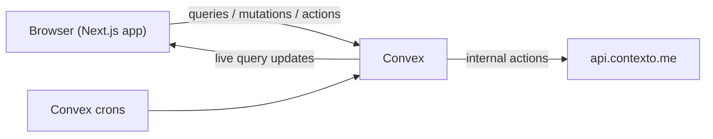

# Architecture

Contextus is a Next.js frontend backed by Convex. All game state lives in Convex, and clients subscribe to it with `useQuery`, so changes reach every player in a room without custom sockets. The Next.js app mostly renders UI. Game logic runs in Convex functions under `convex/`.

## Overview

- **Queries** read state and push updates to subscribed clients.
- **Mutations** make atomic writes: joining rooms, starting games, recording guesses.
- **Actions** call the Contexto API. They never write to the database directly. They pass results to internal mutations, which apply them atomically.

## Module map

### Convex (`convex/`)

| File                 | Responsibility                                                                                   |
| -------------------- | ------------------------------------------------------------------------------------------------ |
| `schema.ts`          | All tables and indexes                                                                           |
| `auth.ts`            | Convex Auth with anonymous (guest) and Google providers, guest-to-account merge on sign-in       |
| `access.ts`          | Auth guards: `requireUser`, `requireRegisteredUser`, `requireMemberByGame`, `requireHostByRoom`… |
| `rooms.ts`           | Create, join, leave, end, play again, and list rooms                                             |
| `games.ts`           | Start a game, read active and finished games, record per-user history                            |
| `guesses.ts`         | `submit` action: the guess pipeline (below)                                                      |
| `gameTransitions.ts` | `applyGuess` / `applyGiveup`: the only mutations that change game state                          |
| `contexto.ts`        | Internal actions wrapping Contexto's `game`, `tip`, and `giveup` endpoints                       |
| `e2eWordOracle.ts`   | Deterministic stand-in for Contexto, used instead of it when `E2E_TEST=1`                        |
| `hints.ts`           | Host hint action and hint execution                                                              |
| `giveup.ts`          | Host give-up action and give-up execution                                                        |
| `requests.ts`        | Non-host hint and give-up requests: create, deny, approve                                        |
| `presence.ts`        | Wraps `@convex-dev/presence` for "who's online in this room"                                     |
| `achievements.ts`    | Profile achievement listing                                                                      |
| `users.ts`           | Profiles, usernames, avatar upload, activity graph, guest account prompt                         |
| `cleanup.ts`         | Host migration, idle-room shutdown, expired-guest anonymization                                  |
| `crons.ts`           | Schedules the cleanup jobs                                                                       |
| `e2eCleanup.ts`      | Purges Playwright test accounts (only usable when `E2E_TEST=1`)                                  |

Pure logic lives in `convex/lib/` so it can be unit tested without a database. This includes the guess decision logic (`gameTransitions.ts`), achievement rules, hint targeting (`hint.ts`), room cleanup decisions (`cleanup.ts`), room codes, and usernames.

### Next.js (`app/`)

| Route              | Purpose                                                            |
| ------------------ | ------------------------------------------------------------------ |
| `/`                | Home: create or join a room, your rooms, recent groups             |
| `/r/[code]`        | Room. State machine: lobby → in-progress → ended                   |
| `/user/[username]` | Public profile: activity graph and achievements                    |
| `/how-to-play`     | Static rules page                                                  |
| `/privacy`         | Analytics and error-reporting notice                               |
| `/signin`          | Google sign-in                                                     |
| `/api/version`     | Current build ID. `NewVersionNotifier` uses it to prompt a refresh |

## Data model

| Table                                                                 | Holds                                                                          |
| --------------------------------------------------------------------- | ------------------------------------------------------------------------------ |
| `users` + `auth*`                                                     | Accounts (Convex Auth). Guests have `isAnonymous: true` and a `guestExpiresAt` |
| `rooms`                                                               | Room code, host, `active` / `ended`                                            |
| `roomMembers`                                                         | Who has joined which room                                                      |
| `roomActivity`                                                        | Last activity time per room (split out to limit write contention on `rooms`)   |
| `games`                                                               | One Contexto puzzle played in a room: `in_progress` / `won` / `given_up`       |
| `gameGuesses`                                                         | Every accepted guess or hint: lemma, distance, who, source                     |
| `wordDistances`                                                       | Global cache of `(contextoGameId, lemma) → distance`, shared by all rooms      |
| `pendingRequests`                                                     | Hint and give-up requests from non-hosts                                       |
| `userGameHistory`                                                     | Per-user first play, first attempt, and first solve for each Contexto puzzle   |
| `gamePlayerStats`                                                     | Per-user, per-game stats used by achievements                                  |
| `userAchievements`, `userAchievementProgress`, `userAchievementStats` | Unlocked achievements, progress counters, and lifetime guess color totals      |
| `userSolveDays`                                                       | Local calendar days on which each user was credited with a solve (streaks)     |

## Guess pipeline

`guesses.submit` is an action because it may need to call Contexto:

1. **Normalize** the input word.
2. **Preflight query** looks up `wordDistances` for this puzzle. A cache hit skips the network call.
3. **On a cache miss**, `contexto.fetchGuess` calls the API. If Contexto maps the input to a different lemma (for example, a plural to its singular), the mapping is cached so the next lookup of that input also hits.
4. **`gameTransitions.applyGuess`** runs as one mutation. It checks the game is still in progress, rejects duplicates (one guess per lemma per game), writes the guess and the cache entry, detects a win, updates room activity and history, and evaluates achievements.
5. The action returns the rank, the win flag, and any newly unlocked achievements. The client shows these as toasts.

Hints and give-ups go through the same `gameTransitions` mutations, so every path that changes game state enforces the same rules.

### Hints

The target distance is 299 if the team hasn't guessed within that range yet. Otherwise it is half the team's best distance. `contexto.fetchTip` fetches the word at that distance and records it as a guess with `source: "hint"`. If the team already has the second-best word, the hint moves outward one rank at a time until it finds a word nobody has guessed yet.

### Requests

The host calls `hints.hostHint` / `giveup.hostGiveup` directly. Other players call `requests.create`, and the host sees the request in the pending sidebar. `approve` runs the same hint or give-up action with the request ID. The request is closed inside the same mutation that applies the result, so two approvals can't both go through.

## Auth and guests

- Anyone who opens the app without an account signs in anonymously and becomes a guest. Guests can be members of at most three active rooms.
- Guest accounts expire after 30 days (1 hour when `E2E_TEST=1`). An expired guest is anonymized to "Former Guest": private rows are deleted, and rows in shared rooms are kept (see `docs/adr/0002-expired-guest-retention.md`).
- When a guest signs in with Google, their rooms, guesses, requests, wins, history, and achievements move to the Google account in scheduled batches (`lib/guestMerge.ts`, tracked by a `guestMerges` row). The leftover guest user is deleted when the last batch finishes.
- `lib/accountLifecycle.ts` declares, for every table that references `users`, what guest merge, guest expiry, and E2E purge do to its rows. The merge runs one batch phase per table in that order. Per-row merge logic lives in `lib/guestMergeRows.ts`.
- Every registered user gets a generated username (see `lib/usernames.ts`). Users can change it on their profile.

## Background jobs

Defined in `crons.ts`:

| Job                   | Interval | What it does                                                                                                                                                                                            |
| --------------------- | -------- | ------------------------------------------------------------------------------------------------------------------------------------------------------------------------------------------------------- |
| room cleanup          | 5 min    | For each active room: if the host is offline and another member is online, the longest-present online member becomes host. If no one is online and the room has been idle for 30 minutes, the room ends |
| expired guest cleanup | 24 h     | Anonymizes expired guests in batches of 50: deletes their owned rows and auth data, then renames them to "Former Guest" so past games stay intact                                                       |

## Observability

Sentry is configured for the client, server, and edge runtimes (`instrumentation*.ts`, `sentry.*.config.ts`). Browser events go through the `/monitoring` tunnel route so ad blockers don't drop them.

PostHog records browser pageviews (`instrumentation-client.ts`) and identifies each player by Convex user ID with an `is_guest` flag, resetting on sign-out (`components/PostHogIdentity.tsx`). Like Sentry, it loads once the page is idle and only on production and preview Vercel deployments, and its events go through the `/ingest` rewrite. Events carry a `deployment_environment` property so previews can be filtered out.

Convex functions record server-side domain events through `track` (`convex/analytics.ts`), which schedules sends via the `@posthog/convex` component so analytics never blocks or fails a mutation. It is a no-op unless `POSTHOG_ENVIRONMENT` is `production` or `preview`.
